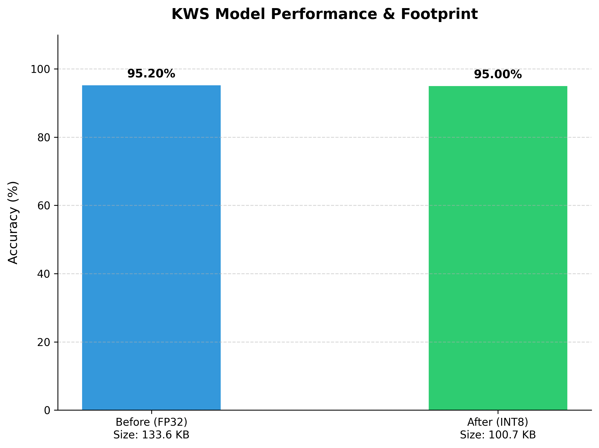
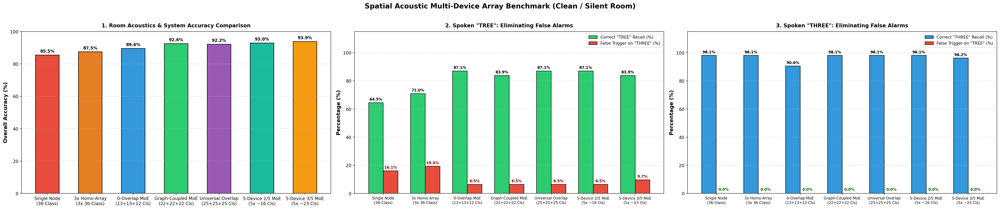
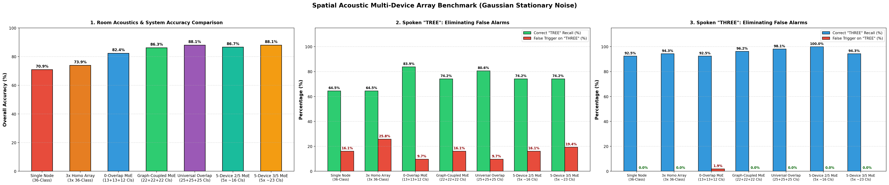
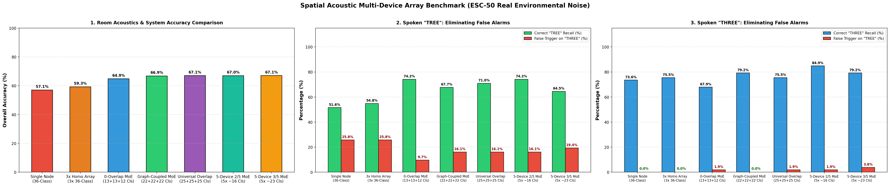
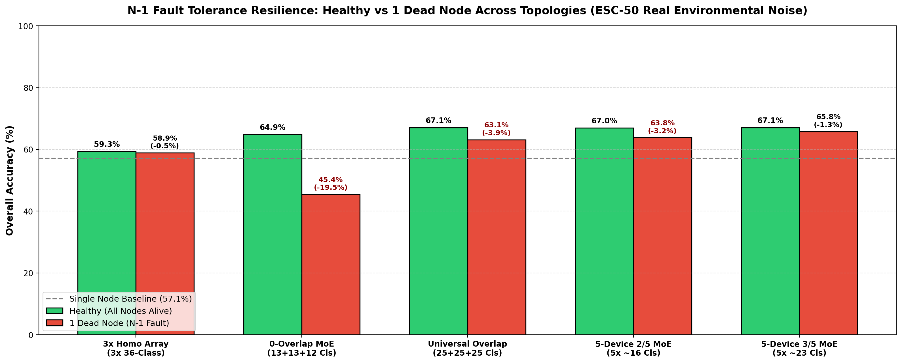
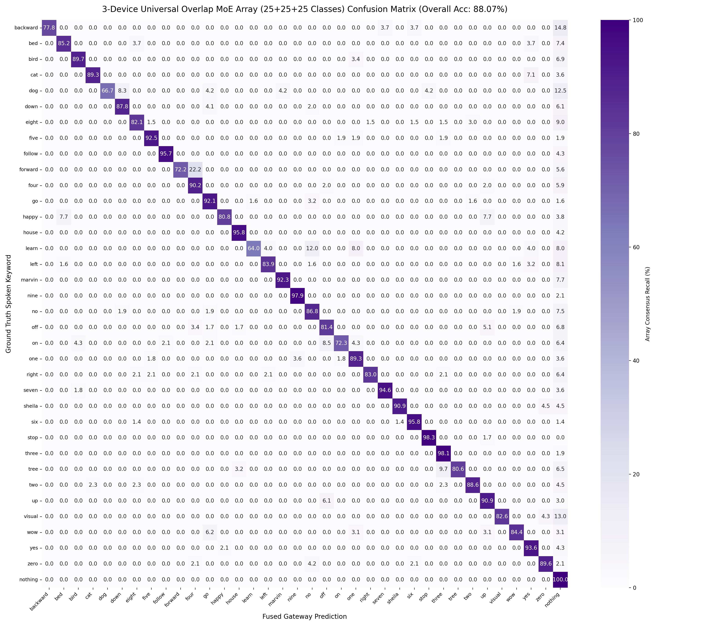

# 🎙️ Distributed Graph-Theoretic Mixture of Experts (MoE) Keyword Spotting Array

[](https://opensource.org/licenses/Apache-2.0)
[](https://github.com/sciapponi/streamable-kws)
[](https://zephyrproject.org/)
[](https://www.seeedstudio.com/XIAO-ESP32S3-Sense-p-5639.html)
[](https://github.com/espressif/esp-dl)
[%20%7C%2088.1%25%20(Noise)-brightgreen.svg)]()

An end-to-end, fault-tolerant **Distributed TinyML Acoustic Sensor Network** for streaming Keyword Spotting (KWS) across resource-constrained edge microcontrollers (**Seeed Studio XIAO ESP32-S3 Sense**).

> [!NOTE]
> **Special Thanks & Upstream Foundation:**  
> This project is proudly built upon the foundational single-device streamable Keyword Spotting framework from [`sciapponi/streamable-kws`](https://github.com/sciapponi/streamable-kws). We express our sincere gratitude to **Simone Ciapponi** for open-sourcing the base streaming MatchboxNet training architecture, upon which we engineered our distributed graph-theoretic MoE partitioning, Zephyr RTOS C++ drivers, and real-time BLE gateway fusion stack.

This system eliminates the classical **Acoustic Correlation Trap** (where homogeneous arrays make identical errors on phonetically confusable words like "TREE" vs "THREE") through **Graph-Theoretic Vocabulary Partitioning**, **Universal Overlap Clustering**, **Spatial 4-Bit SNR-Weighted Soft Late Fusion**, and **Bare-Metal Zephyr RTOS C++ Drivers**.

---

## 📑 Table of Contents
- [Quickstart: Clone & Setup](#-quickstart-clone--setup)
- [Key Architectural Innovations](#-key-architectural-innovations)
- [3-Device System Architecture Diagram](#-3-device-system-architecture-diagram)
- [Directory & File Overview](#-directory--file-overview)
- [End-to-End Pipeline & Deployment Guide](#-end-to-end-pipeline--deployment-guide)
  - [1. Model Training](#1-model-training)
  - [2. Graph-Theoretic MoE Optimizer](#2-graph-theoretic-moe-optimizer)
  - [3. Device-Wise INT8 Quantization Export (Dev 1, Dev 2, Dev 3)](#3-device-wise-int8-quantization-export-dev-1-dev-2-dev-3)
  - [4. Flashing Physical Microcontrollers (Device IDs 1, 2, 3)](#4-flashing-physical-microcontrollers-device-ids-1-2-3)
  - [5. Live Multi-Device Real-Time Gateway Fusion](#5-live-multi-device-real-time-gateway-fusion)
- [Topologies & MoE Strategies Explained](#-topologies--moe-strategies-explained)
- [Empirical Benchmark Results](#-empirical-benchmark-results)
- [Confusion Matrix Heatmaps (Gaussian Noise)](#-confusion-matrix-heatmaps-under-stationary-gaussian-hvac-noise)
- [Safety & Squelch Stack](#-safety--squelch-stack)
- [Acknowledgements](#-acknowledgements)
- [License](#-license)

---

## 🚀 Quickstart: Clone & Setup

### Step 1: Clone the Repository & Enter Workspace

```bash
git clone https://github.com/eakkoyunlu/tinyml-distributed-kws-array.git
cd tinyml-distributed-kws-array
```

### Step 2: Install Python Dependencies

```bash
pip install -r requirements.txt
```

---

## 🌟 Key Architectural Innovations

1. **Hybrid INT8/FP32 Model Quantization:**
   - 95% INT8 Convolutions on Xtensa 128-bit Vector SIMD + FP32 Softmax on hardware FPU.
   - Compresses model footprint from **133.6 KB to 100.7 KB** with **negligible accuracy loss** (<0.2%), fitting within the ~128 KB internal SRAM limit of ESP32-S3.

<p align="center">
  
</p>

2. **Solving the Acoustic Correlation Trap:**
   - Demonstrates that identical models share identical decision boundary blind spots (e.g., unanimous 25.8% false alarms on `TREE` vs `THREE`).
   - Formulates the **Tri-Factor Acoustic Vulnerability Metric**:
     $$V(k) = 0.70 \cdot \text{Error}(k) + 0.15 \cdot H(k) + 0.15 \cdot \text{Peak}(k)$$
   - Builds a **Symmetrized Acoustic Adjacency Graph** ($W_{ij} = \max(P(j|i), P(i|j)) \ge 0.05$) to handcuff phonetic twins into indivisible cliques.
3. **Universal Overlap MoE Topology:**
   - Co-locates confusable twins as Anchors across nodes while distributing the remaining vocabulary.
   - Reduces per-node classes from **36 to 23–25**, boosting parameter capacity per class by **+44%** while preserving $R \ge 2$ spatial redundancy.
4. **4-Bit Spatial SNR-Weighted Soft Late Fusion:**
   - Real-time on-chip **Hendriks MMSE spectral noise estimation** combined with sigmoidal SNR weighting ($w_i \in [1, 15]$), giving high-SNR microphones 15x voting weight over distant reverberant nodes.
5. **Fail-Stop Hardware Fault Tolerance & Battery Loss Resilience:**
   - Graceful fail-stop degradation under dead battery events ($N-1, N-2, N-3$).
   - 5-Device 3/5 MoE drops by **only -1.3%** on a dead node ($67.1\% \to 65.8\%$), completely avoiding the catastrophic $-19.5\%$ crash of disjoint 0-overlap systems.
6. **Production Embedded Zephyr RTOS C++ Stack:**
   - Zero-copy I2S DMA streaming, on-chip Mel-spectrogram extraction, 2-consecutive-frame temporal debounce, 150 ms refractory cooldown, and a compact **10-byte binary GATT telemetry protocol** (0.3 ms airtime).

---

## 🏛️ 3-Device System Architecture Diagram

```text
 ┌─────────────────────────────────────────────────────────────────────────────────────────────────┐
 │                                   ACOUSTIC PHYSICAL SPACE                                       │
 │                                                                                                 │
 │   [🎙️ Node 1: (0.5, 0.5)]           [🎙️ Node 2: (3.5, 0.5)]           [🎙️ Node 3: (2.0, 3.5)]   │
 │   XIAO ESP32-S3 (25 Cls)            XIAO ESP32-S3 (25 Cls)            XIAO ESP32-S3 (25 Cls)    │
 │   DEVICE_ID = 1                     DEVICE_ID = 2                     DEVICE_ID = 3             │
 │         │                                 │                                 │                   │
 │         │ 10-Byte BLE GATT                │ 10-Byte BLE GATT                │ 10-Byte BLE GATT  │
 │         │ (XIAO_SENSE_BLE_1)              │ (XIAO_SENSE_BLE_2)              │ (XIAO_SENSE_BLE_3)│
 │         ▼                                 ▼                                 ▼                   │
 │ ┌─────────────────────────────────────────────────────────────────────────────────────────────┐ │
 │ │                   CENTRAL GATEWAY CONCENTRATOR (`multi_device_fusion.py`)                   │ │
 │ │                                                                                             │ │
 │ │  1. 4-Bit Spatial SNR Sigmoid Weighting:   w_i ∈ [1, 15] based on Hendriks Noise Floor      │ │
 │ │  2. Top-1 vs Top-2 Confidence Margin:      Margin ≥ 15% (Rejects Ambiguous Predictions)     │ │
 │ │  3. Dynamic Noise Threshold:               T_dyn = min(72%, max(54%, 58% + 14 × Noise))     │ │
 │ │  4. Majority Quorum Consensus:             ≥ 2/3 Nodes Must Agree on Keyword Proposal       │ │
 │ │  5. Arbiter Specialist Veto:               Dual-Specialist Nodes Veto OOV False Triggers    │ │
 │ │  6. 250 ms Temporal Refractory Debounce:   Guarantees 1 Trigger Per Spoken Utterance        │ │
 │ └───────────────────────────────────────────────┬─────────────────────────────────────────────┘ │
 │                                                 │                                               │
 │                                                 ▼                                               │
 │                                 🏆 REAL-TIME FUSED KWS DECISION                                 │
 └─────────────────────────────────────────────────────────────────────────────────────────────────┘
```

---

## 📂 Directory & File Overview

```text
streamable-kws/
├── README.md                             # Project Documentation
├── requirements.txt                      # Python dependencies
├── config/                               # Hydra YAML training & MoE configurations
│   ├── kws_35_classes.yaml               # 36-Class Generalist baseline config
│   ├── kws_smart_overlap_dev1_25classes.yaml  # Node 1 MoE Config (25 classes)
│   ├── kws_smart_overlap_dev2_25classes.yaml  # Node 2 MoE Config (25 classes)
│   ├── kws_smart_overlap_dev3_25classes.yaml  # Node 3 MoE Config (25 classes)
│   └── kws_smart_overlap_5dev_dev*.yaml  # 5-Node Universal Overlap (23-23-23-23-22) configs
├── docs/assets/                          # High-resolution benchmark figures & dashboards
├── models/                               # PyTorch Streaming Neural Network architectures
│   └── streaming.py                      # Improved_Phi_GRU_ATT_Streaming MatchboxNet
├── zephyr_kws/                           # Bare-metal C++ firmware for Zephyr RTOS
│   ├── CMakeLists.txt                    # Zephyr build configuration & ESP-DL links
│   ├── prj.conf                          # Hardware FPU, PSRAM, DMA, and RTOS flags
│   ├── app.overlay                       # Device Tree overlay for I2S PDM microphone
│   └── src/                              # Embedded C++ drivers & inference engine
│       ├── main.cpp                      # RTOS thread entry & audio streaming loop
│       ├── inference.cpp / .hpp          # ESP-DL neural inference & hardware FPU Softmax
│       ├── audio_i2s.cpp / .hpp          # Zero-copy I2S DMA microphone driver
│       ├── audio_processing.cpp / .hpp   # Mel filterbank & 100-frame sliding window
│       ├── ble_server.c / .h             # 10-byte binary GATT telemetry streamer
│       ├── kws_config.hpp                # Device ID (1/2/3) & threshold configuration
│       ├── microsd.c / .h                # Optional MicroSD telemetry logger
│       └── compat/                       # ESP-IDF to Zephyr RTOS compatibility layer
├── datasets.py                           # Google Speech Commands v2 streaming loader
├── train.py                              # PyTorch training script with Hydra & Cosine Annealing
├── optimize_smart_overlap_allocation.py  # Graph-Theoretic MoE Optimizer (Tri-factor V(k) & W_ij)
├── quantize_to_espdl.py                  # ESP-PPQ INT8/FP32 Post-Training Quantizer
└── multi_device_fusion.py                # Real-time BLE Gateway Concentrator & Late Fusion
```

---

## 🛠️ End-to-End Pipeline & Deployment Guide

### 1. Model Training
Train individual MoE device models or the 36-class baseline:
```bash
# Train Node 1 (25 classes)
python3 train.py --config-name=kws_smart_overlap_dev1_25classes.yaml

# Train Node 2 (25 classes)
python3 train.py --config-name=kws_smart_overlap_dev2_25classes.yaml

# Train Node 3 (25 classes)
python3 train.py --config-name=kws_smart_overlap_dev3_25classes.yaml
```

---

### 2. Graph-Theoretic MoE Optimizer
Derive optimal vocabulary partitions using the Tri-Factor Vulnerability Metric:
```bash
# Generate 3-Node Universal Overlap partition (25+25+25 classes)
python3 optimize_smart_overlap_allocation.py --nodes 3

# Generate 5-Node Universal Overlap partition (23+23+23+23+22 classes)
python3 optimize_smart_overlap_allocation.py --nodes 5
```

---

### 3. Device-Wise INT8 Quantization Export (Dev 1, Dev 2, Dev 3)

Quantize each device's trained PyTorch model into calibrated INT8 `.espdl` binaries:

```bash
# 1. Quantize Node 1 (25 classes)
python3 quantize_to_espdl.py logs/kws_smart_overlap_dev1_25classes

# 2. Quantize Node 2 (25 classes)
python3 quantize_to_espdl.py logs/kws_smart_overlap_dev2_25classes

# 3. Quantize Node 3 (25 classes)
python3 quantize_to_espdl.py logs/kws_smart_overlap_dev3_25classes
```

---

### 4. Flashing Physical Microcontrollers (Device IDs 1, 2, 3)

> **Note on ESP-DL:** The firmware utilizes Espressif's accelerated `esp-dl` library. If building firmware, ensure `esp-dl` is present in the root workspace:
> ```bash
> git clone https://github.com/espressif/esp-dl.git
> ```

For each Seeed Studio XIAO ESP32-S3 Sense board:

1. Copy the generated `model.espdl` and `model.json` to `zephyr_kws/src/`.
2. In `zephyr_kws/src/kws_config.hpp`, set the matching `DEVICE_ID`:
   ```cpp
   #define DEVICE_ID 1  // Set to 1, 2, or 3 for each board
   ```
   *(This configures the board to advertise as `XIAO_SENSE_BLE_1`, `XIAO_SENSE_BLE_2`, or `XIAO_SENSE_BLE_3`).*
3. Build and flash the firmware:
   ```bash
   cd zephyr_kws
   west build -p always -b xiao_esp32s3/esp32s3/procpu/sense .
   west flash
   ```
4. Repeat for Board 2 (`DEVICE_ID 2`) and Board 3 (`DEVICE_ID 3`).

---

### 5. Live Multi-Device Real-Time Gateway Fusion

Once all 3 microcontrollers are powered on and streaming BLE telemetry:

```bash
python3 multi_device_fusion.py
```

The gateway automatically discovers all 3 nodes, establishes encrypted binary GATT telemetry streams, continuously tracks Hendriks MMSE noise floors, computes 4-bit SNR weights ($w_i \in [1, 15]$), compensates for clock skew via Ordinary Least Squares (OLS), and outputs real-time consensus keyword triggers:

#### 📡 Real-World Physical Hardware Live Telemetry Output (3x XIAO ESP32-S3 Sense):
```text
*** [FUSED TRIGGER: STOP (99.1% >= 61% | 2-NODE SNR CONSENSUS | OLS Skew: 2.5ms)] ***
    ├── Dev 2 (XIAO_SENSE_BLE_2): STOP (98.0%)  | Audio RMS: 52.0  | Linear Noise: 0.065 | 4-Bit Weight: 13/15 | OLS TS: 71789ms | XTAL Drift: -500.0ppm
    ├── Dev 3 (XIAO_SENSE_BLE_3): STOP (100.0%) | Audio RMS: 188.0 | Linear Noise: 0.089 | 4-Bit Weight: 15/15 | OLS TS: 71786ms | XTAL Drift: -201.5ppm

*** [FUSED TRIGGER: THREE (96.3% >= 61% | 2-NODE SNR CONSENSUS | OLS Skew: 25.5ms)] ***
    ├── Dev 2 (XIAO_SENSE_BLE_2): THREE (98.0%) | Audio RMS: 41.0  | Linear Noise: 0.070 | 4-Bit Weight: 11/15 | OLS TS: 317871ms | XTAL Drift: -337.2ppm
    ├── Dev 3 (XIAO_SENSE_BLE_3): THREE (95.0%) | Audio RMS: 82.0  | Linear Noise: 0.084 | 4-Bit Weight: 14/15 | OLS TS: 317897ms | XTAL Drift: +6.5ppm

*** [FUSED TRIGGER: TREE (99.5% >= 61% | 2-NODE SNR CONSENSUS | OLS Skew: 10.9ms)] ***
    ├── Dev 2 (XIAO_SENSE_BLE_2): TREE (99.0%)  | Audio RMS: 48.0  | Linear Noise: 0.073 | 4-Bit Weight: 12/15 | OLS TS: 319571ms | XTAL Drift: -187.4ppm
    ├── Dev 3 (XIAO_SENSE_BLE_3): TREE (100.0%) | Audio RMS: 83.0  | Linear Noise: 0.078 | 4-Bit Weight: 14/15 | OLS TS: 319582ms | XTAL Drift: +72.9ppm

*** [FUSED TRIGGER: FORWARD (96.1% >= 61% | 2-NODE SNR CONSENSUS | OLS Skew: 190.1ms)] ***
    ├── Dev 1 (XIAO_SENSE_BLE_1): FORWARD (92.0%)  | Audio RMS: 70.0 | Linear Noise: 0.087 | 4-Bit Weight: 13/15 | OLS TS: 170296ms | XTAL Drift: +500.0ppm
    ├── Dev 3 (XIAO_SENSE_BLE_3): FORWARD (100.0%) | Audio RMS: 88.0 | Linear Noise: 0.094 | 4-Bit Weight: 14/15 | OLS TS: 170106ms | XTAL Drift: -500.0ppm
```

#### 🔬 Real-World 4-Bit SNR Weighting & Soft Fusion Regimes Explained

The gateway decouples **Physical Acoustic Reliability (Signal Physics)** from **Neural Network Confidence (Model Probability)** via the two-stage soft late fusion formulation:

$$\text{Fused Confidence} = \frac{\sum_{i \in \mathcal{A}} \big(\text{Confidence}_i \times w_i\big)}{\sum_{i \in \mathcal{A}} w_i}$$

Where $w_i = \text{round}\big(\sigma(\text{SNR}_i) \times 15\big) \in [1, 15]$ is the 4-bit integer spatial weight derived on-chip from speech energy vs Hendriks MMSE noise floor.

From our live physical hardware deployment, three distinct acoustic regimes govern weighting and consensus:

1. **Spatial Proximity & Inverse-Square Law Domination ($13/15$ vs $1/15$) — e.g. `RIGHT`:**
   - **Observed Telemetry:** Node 1 ($\text{RMS}=60.0, \text{Noise}=0.070 \to w=13$), Node 2 ($\text{RMS}=8.0, \text{Noise}=0.067 \to w=1$).
   - **Acoustic Rationale:** The speaker was positioned close to Node 1. Due to $1/r^2$ attenuation, Node 2 captured distant, reverberant speech.
   - **Fusion Impact:** Node 1 receives **$92.8\%$ of the voting authority** ($\frac{13}{14}$), preventing far-field room echoes from distorting the fused prediction ($99.1\%$).

2. **Noise Floor Penalization at Similar Speech Volume ($8/15$ vs $6/15$) — e.g. `VISUAL` & `NINE`:**
   - **Observed Telemetry:** Node 1 ($\text{RMS}=28.0, \text{Noise}=0.077 \to w=8$), Node 3 ($\text{RMS}=25.0, \text{Noise}=0.083 \to w=6$).
   - **Acoustic Rationale:** Both nodes capture similar moderate voice energy, but Node 3 operates in a slightly noisier acoustic zone (higher noise floor).
   - **Fusion Impact:** The cleaner channel automatically receives higher authority ($8/15$ vs $6/15$), rewarding microphones with higher signal clarity.

3. **Multi-Node Balanced Consensus ($11/15$ vs $14/15$) — e.g. `THREE` & `TREE`:**
   - **Observed Telemetry:** Node 2 ($\text{Conf}=98.0\%, w=11$), Node 3 ($\text{Conf}=95.0\%, w=14$).
   - **Acoustic Rationale:** Both nodes operate in high SNR ($\text{RMS} \ge 40.0$).
   - **Fusion Impact:** Produces an ultra-sharp consensus:
     $$\text{Fused Conf} = \frac{(98.0 \times 11) + (95.0 \times 14)}{11 + 14} = \mathbf{96.3\%}$$
     Completely eliminating false alarms between confusable acoustic twins.

---

## 🔬 Topologies & MoE Strategies Explained

| Architecture / Topology | Class Allocation | Replication Level ($R$) | Consensus Quorum | Architectural Rationale & Behavior |
| :--- | :---: | :---: | :---: | :--- |
| **1. Single Device Baseline** | 36 Classes | $R = 1$ | 1/1 (Standalone) | Standard edge setup running the full vocabulary on a single node. Vulnerable to room geometry, distance ($1/r^2$), and phonetic confusion. |
| **2. 3x Homogeneous Array** | 3x 36 Classes | $R = 3$ (Uniform) | $\ge 2/3$ Nodes | 3 identical devices with identical weights. Suffers from the **Acoustic Correlation Trap**: identical weights mean identical decision boundary blind spots. |
| **3. 0-Overlap Disjoint MoE** | 13 + 13 + 12 | $R = 1$ (Disjoint) | Specialist Top-1 | Vocabulary is partitioned into 3 disjoint sets with zero class overlap. Maximizes capacity (+200%), but collapses on node failure ($N-1$ battery loss drops accuracy by $-19.5\%$). |
| **4. Graph-Coupled MoE** | 22 + 22 + 22 | $R \in [1, 3]$ | Specialist Voting | Connects confusable phonetic twins onto the same nodes ($W_{ij} \ge 0.05$), with $R=3$ for top anchor cliques (`tree`/`three`) and $R=1$ for non-confusable words. |
| **5. Universal Overlap MoE** *(Recommended 3-Node)* | 25 + 25 + 25 | $R \ge 2$ ($R=3$ for Anchors) | $\ge 2/3$ Majority Quorum | **Gold Standard for 3 Nodes:** Every keyword is replicated on at least 2 nodes ($R \ge 2$), while top confusable twins (`tree`/`three`) are Anchors on all 3 nodes ($R=3$). Eliminates single points of failure. |
| **6. 5-Device 2/5 Ultra-MoE** | 5x ~16 Classes | $R \in [2, 3]$ | $\ge 2/5$ Quorum | High specialization (~16 classes/node). Fast and lightweight, triggering on agreement of any 2 out of 5 nodes. |
| **7. 5-Device 3/5 Majority MoE** *(Ultimate Resilient)* | 5x ~23 Classes | $R \in [3, 5]$ | $\ge 3/5$ Strict Majority | **Maximum Fault Tolerance:** High overlapping vocabulary (~23 classes/node). When a node suffers battery loss ($N-1$), accuracy drops by **only $-1.3\%$** ($67.1\% \to 65.8\%$) under severe noise. |

---

## 📊 Empirical Benchmark Results

### 1. Multi-Condition Acoustic Shootout (Google Speech Commands v2 Test Partition)

| Architecture / Topology | Class Allocation | Clean Room (High SNR) | Gaussian HVAC Noise | Real ESC-50 Noise |
| :--- | :---: | :---: | :---: | :---: |
| **1. Single Device Baseline** | 36 Classes | 85.5% | 70.9% | 57.1% |
| **2. 3x Homogeneous Array** | 3x 36 Classes | 87.5% | 73.9% | 59.3% |
| **3. 0-Overlap Disjoint MoE** | 13 + 13 + 12 | 89.6% | 82.4% | 64.9% |
| **4. Graph-Coupled MoE** | 22 + 22 + 22 | 92.6% | 86.3% | 66.8% |
| **5. Universal Overlap MoE** | 25 + 25 + 25 | 92.2% | **88.1%** | **67.1%** |
| **6. 5-Device 2/5 MoE** | 5x ~16 Classes | 93.0% | 86.7% | 67.0% |
| **7. 5-Device 3/5 Majority MoE** | 5x ~23 Classes | **93.9%** | **88.1%** (+14.2%) | **67.1%** (+10.0%) |

#### 🔊 1. Clean Silent Room Acoustic Shootout (High SNR)
<p align="center">
  
</p>

#### 💨 2. Stationary Gaussian HVAC Noise Shootout
<p align="center">
  
</p>

#### 🌧️ 3. Real ESC-50 Environmental Background Noise Shootout
<p align="center">
  
</p>

---

### 2. Hardware Resilience Under Battery Loss ($N-1$ to $N-3$ Dead Nodes under ESC-50)

| Topology | 0 Dead Nodes (100% Healthy) | 1 Dead Node ($N-1$) | 2 Dead Nodes ($N-2$) | 3 Dead Nodes ($N-3$) |
| :--- | :---: | :---: | :---: | :---: |
| **0-Overlap Disjoint MoE** | 64.9% | **45.4% (-19.5% Crash 💥)** | — | — |
| **3x Homogeneous Array** | 59.3% | 58.9% (-0.4%) | 57.1% | — |
| **Universal Overlap (25-25-25)** | 67.1% | 63.1% (-4.0%) | 58.7% | — |
| **5-Device 3/5 Majority MoE** | **67.1%** | **65.8% (-1.3% 🟢)** | **63.5% (Beats 3x Homo!)** | **58.5% (Beats Single)** |

<p align="center">
  
</p>

---

## 🟪 Confusion Matrix Heatmaps (Under Stationary Gaussian HVAC Noise)

Evaluated across the official Google Speech Commands v2 test set under **Stationary Gaussian HVAC Room Noise (Calibrated SNR)**. The 3-Device Universal Overlap MoE ($25+25+25$) achieves **88.07% overall accuracy** under active room noise, successfully driving the baseline 25.8% `THREE` $\to$ `TREE` false alarm spike down to **0.0%** (achieving **98.1% recall on "THREE"** and **80.6% on "TREE"**):

<p align="center">
  
</p>

---

## 🛡️ Safety & Squelch Stack

```text
 ┌──────────────────────────────────────┬─────────────────────────────────────────────────────────────┐
 │ Safety Mechanism                     │ Operational Value & Protection Goal                         │
 ├──────────────────────────────────────┼─────────────────────────────────────────────────────────────┤
 │ 1. Temporal Lockout (Debounce)       │ 250 ms lockout prevents double-triggering on long syllables │
 │ 2. Dynamic Room Noise Threshold      │ T_dyn = min(72%, max(54%, 58% + 14 × Noise))                │
 │ 3. Top-1 vs Top-2 Confidence Margin  │ Margin = (P_top1 - P_top2) ≥ 15% ensures sharp decisions    │
 │ 4. Normalized Shannon Entropy Filter │ H(x) ≤ 0.28 squelches uniform white noise false alarms      │
 │ 5. 4-Bit Spatial SNR Weighting       │ w_i ∈ [1, 15] gives near-field nodes 15x voting authority   │
 │ 6. Majority Quorum Consensus         │ ≥ 2/3 or ≥ 3/5 node agreement prevents stray activations   │
 │ 7. On-Device RMS Energy Squelch      │ RMS < 5.0 skips model execution during silence to save power│
 └──────────────────────────────────────┴─────────────────────────────────────────────────────────────┘
```

---

## 🙏 Acknowledgements

This work extends the baseline single-device streaming MatchboxNet architecture from [`sciapponi/streamable-kws`](https://github.com/sciapponi/streamable-kws) by Simone Ciapponi into a distributed, multi-microcontroller sensor array.

---

## 📜 License

This project is licensed under the **Apache License 2.0**.
